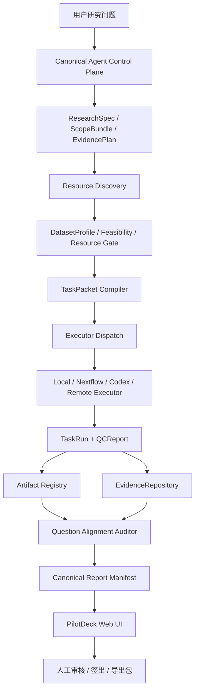

# TargetCompass V5 项目完整报告

TargetCompass V5 是一个面向生物医学研究的本地 Agent 平台原型。它的目标不是简单串联多个聊天机器人，而是把“用户研究问题 → 结构化理解 → 数据/文献/方法可行性判断 → 分析任务包 → 执行与 QC → Evidence DB → 候选结论与报告 → 人工审核”的全过程做成可追溯、可复核、可扩展的工程系统。

当前交付版本是 **v5 本地单机开发验收版 / 教授演示版**。它不要求登录，不做 OIDC/Vault，多用户生产权限系统留到后续商业化阶段。

## 1. 项目要解决的问题

传统生信分析和靶点发现流程中，很多关键步骤依赖人工经验：

- 把自然语言研究问题拆成可执行的子问题；
- 判断数据集是否真的适合分析；
- 判断 metadata 是否足够支持分组；
- 判断矩阵、基因名、样本信息是否能对齐；
- 选择 bulk、scRNA、SASP、surface marker、cell-type evidence、enrichment、meta-analysis 等方法；
- 记录失败原因和恢复建议；
- 把每个结果写入证据链；
- 防止报告结论超过证据等级。

TargetCompass V5 的核心思想是：**LLM 和 Codex 替代人类重复性的规划、检查、代码执行和报告整理工作，但所有科学结论必须落到结构化证据、QC、artifact 和人工 gate 上。**

## 2. 当前版本定位

当前版本适合：

- 给教授演示本地 Agent 生信平台；
- 给甲方或 GPT 验收 v5 架构是否闭环；
- 给另一个 Codex 接手继续开发；
- 在本机跑真实 LLM/resource discovery/部分真实数据分析；
- 展示 Evidence、QC、Artifact、Report 的可追溯链路。

当前版本不承诺：

- 生产级 Web 登录；
- 云端多租户部署；
- 签名安装器；
- 完整离线 R/Nextflow/Docker 环境；
- 所有 SRA/cellxgene 数据都能自动进入真实矩阵分析；
- metadata 不足时自动锁库并生成结论。

## 3. 总体架构



## 4. 七个 Canonical Agent

v5 定义了 7 个规范 Agent。每个 Agent 之间不传大段自由文本，只传 object refs、artifact refs、evidence refs 和 handoff JSON。

1. **question_normalizer**
   把自然语言问题转成 ResearchSpec 和 SubQuestion。

2. **scope_resolver**
   明确 species、tissue、condition、cell type、disease scope。

3. **evidence_plan_builder**
   生成 EvidencePlan，定义需要哪些证据轴。

4. **resource_discovery_agent**
   检索 GEO/SRA/ArrayExpress/cellxgene、PubMed/Europe PMC，输出 ResourceCandidate、DatasetProfile、DatasetSelectionDecision。

5. **method_adapter_workorder_compiler**
   根据数据反向约束方法，生成 WorkflowPlan、AnalysisTaskPacket、ReviewTaskPacket。

6. **result_auditor**
   审核 TaskRun、ArtifactManifest、QCReport，只写审计结果，不修改原始结果。

7. **evidence_synthesizer_reporter**
   只消费 audited evidence，生成候选结论、限制和报告 manifest。

## 5. 核心工程对象

| 对象 | 作用 |
|---|---|
| ResearchSpec | 结构化研究问题 |
| ScopeBundle | 物种、组织、疾病、细胞类型等边界 |
| EvidencePlan | 证据轴和 claim ceiling |
| DatasetProfile | 数据集可用性、metadata、样本、平台 |
| DatasetFeasibilityReport | 数据能否支持目标分析 |
| MethodContract | bulk/scRNA/SASP/surface/cell-type 等方法合同 |
| CompatibilityDecision | 数据反向约束方法的红线决策 |
| TaskPacket | Analysis / Engineering / Review 三类任务包 |
| TaskRun | 每个任务实际执行记录 |
| QCReport | 四层 QC：Execution / Data / Statistical / Biological |
| ArtifactManifest | 文件存在性、checksum、producer、QC、placeholder 标记 |
| EvidenceItem | 可进入 Evidence DB 的结构化证据 |
| QuestionAlignmentReport | 检查 claim 是否回答原问题、是否超证据等级 |
| CanonicalReportManifest | v5 报告总 manifest |

## 6. 当前已完成能力

### v5 控制面

- Canonical schemas；
- ProjectState + EventLog；
- Agent handoff protocol；
- mock runner；
- real local runner；
- Task Registry；
- Codex Worker protocol；
- Artifact Registry；
- Question Alignment Auditor；
- Canonical report manifest。

### 真实资源发现

- GEO 检索；
- SRA 候选检索；
- ArrayExpress/cellxgene 候选接入；
- PubMed / Europe PMC 检索；
- resource gate；
- matrix_parse_ready 前置判断；
- metadata 人工纠错入口；
- 候选数据集 verified gate。

### 真实分析路径

已接入或具备路径：

- GEO import；
- matrix parse；
- metadata alignment；
- bulk DEG；
- SASP score；
- surface marker；
- cell-type evidence；
- enrichment；
- meta-analysis；
- causal grading 雏形；
- Nextflow contract；
- local executor contract；
- ArtifactStore / EvidenceRepository 主路径。

### UI / PilotDeck

- 首页工作台；
- v5 流程页；
- resource gate；
- analysis main path；
- product report；
- release acceptance；
- production readiness；
- storage/backend write；
- evidence / artifact / claim drill-down；
- memory audit；
- wet-lab protocol signoff；
- 中文 / 日本語 / English 下拉切换。

### Windows 封装

- `TargetCompassV5_Setup.exe`；
- zip 安装包；
- embedded Python 缓存；
- wheelhouse；
- 安装、启动、停止、重启、修复、卸载脚本；
- 默认 demo 项目；
- v5-doctor 自检；
- 发布前验收脚本。

## 7. 交付文件

最终文件位于：

```text
C:\Users\ASUS\Documents\target\dist
```

推荐交付：

```text
TargetCompassV5_Setup.exe
TargetCompassV5_Windows_Installer_20260624T164502Z.zip
targetcompass_v5_developer_bundle_20260624T164303Z.zip
targetcompass_v5_professor_demo_bundle_20260624T164303Z.zip
TargetCompassV5_DELIVERY_INDEX_CN.md
```

文档：

```text
docs/TargetCompass_v5_最终交付说明_CN.md
docs/TargetCompass_v5_用户使用手册_CN.md
docs/TargetCompass_v5_开发验收版使用说明.md
docs/v5_software_figures_cn.md
```

## 8. 安装与启动

### 普通用户

双击：

```text
TargetCompassV5_Setup.exe
```

安装后点击桌面或开始菜单：

```text
TargetCompass V5
```

程序会启动本地服务并打开默认浏览器。

### 开发者

```powershell
cd C:\Users\ASUS\Documents\target
python tc_lite.py serve --project vascular_aging_demo --host 127.0.0.1 --port 8831
```

打开：

```text
http://127.0.0.1:8831/
```

## 9. 常用验收命令

```powershell
python -m unittest tests.test_webapp -v
python tc_lite.py v5-doctor --project vascular_aging_demo
python tc_lite.py v5-release-acceptance --project vascular_aging_demo --question-count 50
```

当前本机结果：

- Webapp tests：PASS，20/20；
- v5-doctor：PASS；
- Release acceptance：REVIEW。

`Release acceptance` 为 REVIEW 的原因是：干净 Windows/VM 安装、启动、停止、重启、卸载记录还没有在目标机器完成。这不是本机封装失败，而是交付前外部验收项。

## 10. Web UI 主要页面

| 页面 | 地址 |
|---|---|
| 首页 | `/` |
| v5 流程 | `/v5/canonical-flow` |
| 数据集锁库 | `/v5/resource-gate` |
| 真实分析主路径 | `/v5/analysis-main-path` |
| 研究报告 | `/v5/product-report` |
| 生产就绪 | `/v5/production-readiness` |
| 发布验收 | `/v5/release-acceptance` |
| 存储后端 | `/v5/storage` |
| 权限雏形 | `/v5/access` |
| Artifact 详情 | `/v5/artifacts` |
| Evidence / Claim | `/v5/evidence-claims` |
| Memory 审计 | `/v5/memory` |
| Wet-lab protocol | `/v5/wetlab` |

## 11. 与实验室服务器的接入点

推荐不要从 UI 直接接服务器，而从这条链路接：

```text
TaskPacket -> Executor -> TaskRun/QCReport -> ArtifactStore/EvidenceRepository -> Report
```

优先级：

1. ArtifactStore 接实验室 MinIO / NAS / S3；
2. EvidenceRepository 接实验室 PostgreSQL；
3. 新增 remote_executor；
4. 增加 Nextflow `lab` / `slurm` profile；
5. 外部化 MCP/HTTP Gateway 给其他系统调用。

## 12. 科学有效性原则

TargetCompass V5 不允许：

- placeholder dataset 进入 DATASETS_LOCKED；
- metadata 不足时伪造分组；
- matrix 不可解析时推荐真实分析；
- failed QC evidence 支持 approved claim；
- abstract-only evidence 冒充全文/实验/组学证据；
- report claim 超过 EvidencePlan / claim ceiling；
- generator role 审批自己的输出。

## 13. 当前剩余工作

交付版可接受但未完成商业化的部分：

- 干净 Windows/VM 安装验收；
- exe 签名；
- 完整离线 R/Nextflow/Docker 缓存；
- SRA/cellxgene 真实矩阵路径大样本；
- 生产级 OIDC/Vault 登录；
- PostgreSQL/MinIO 完全替代所有 legacy writer；
- 长期 memory 更多真实回滚演练；
- wet-lab protocol 从建议升级为正式 SOP。

## 14. 结论

TargetCompass V5 当前已经从 MVP 演示升级为一个具备规范 Agent 协议、任务包、执行记录、QC、Artifact Registry、Evidence Repository、报告 manifest 和本地 Web UI 的可交付平台原型。

它适合以 **本地开发验收版 / 教授演示版** 交付。后续如果进入生产化，应重点推进服务器执行后端、真实多用户权限、签名安装器、离线运行时缓存和更大规模真实数据路径验收。
