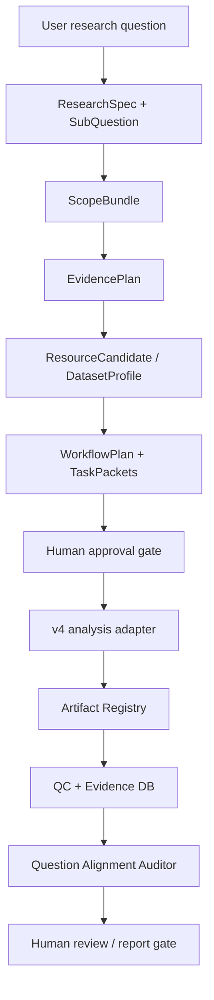

# TargetCompass v5 Canonical Agent Architecture

## Purpose

TargetCompass v5 adds a canonical control plane on top of the existing v4 bioinformatics execution modules. The goal is to make user questions, agent handoffs, task packets, artifacts, evidence, claim ceilings, and human review gates explicit and traceable.

v5 is not a replacement for all v4 execution code yet. The first production strategy is control-plane first, data-plane reuse.

## Current v4 Capabilities To Reuse

The v4 codebase already contains useful scientific and execution components:

- Evidence planning objects such as `EvidencePlan`, `DatasetProfile`, `MethodContract`, and compatibility decisions.
- Dataset discovery/import and recovery modules for GEO/GSE-style workflows.
- Analysis modules for bulk DEG, scRNA, SASP scoring, enrichment, meta-analysis, and annotation flows.
- WorkOrder DAG and attempt records.
- QC and QC review modules.
- Evidence DB, evidence import, trace, snapshot, and query behavior.
- Review queue, approval records, signoff, and report generation.
- MCP gateway/service contracts and audit logs.
- Codex engineering queue and controlled patch/test/result ideas.

These should be called through adapters instead of being rewritten immediately.

## Current v4 Limits

The v4 system also has limits that v5 is designed to address:

- Multiple agent/control-plane shells exist in parallel.
- Some flows can still behave like metadata-only runners.
- The imported external six-agent package is a mock planning pipeline, not a production scientific runner.
- Some demo compatibility paths include hardcoded sarcopenia/SASP fallback behavior.
- Schema validation is intentionally lightweight and does not cover all cross-field scientific rules.
- File existence does not prove scientific success.
- Artifact identity is not always content-addressed.
- Association-level expression evidence can be accidentally over-read unless claim ceilings are enforced.

## v5 Additions

The v5 canonical layer currently adds:

- Canonical schemas and stable IDs.
- `ProjectState` and append-only `EventLog`.
- Agent specs and JSON-only handoff protocol.
- Mock orchestration runner that stops at task packets.
- External agent contract import as reference-only resources.
- Artifact Registry with checksum, placeholder, QC, and schema metadata.
- Question Alignment Auditor.
- Codex Worker protocol with approval, claim, lease, release, complete, and fail states.

All v5 project outputs are written under:

```text
project_dir/v5/
```

## Production Strategy

The first production strategy is:

1. Use v5 as the canonical control plane.
2. Keep v4 analysis modules as the execution data plane.
3. Add adapters from v5 task packets to v4 modules.
4. Keep human review gates before execution and before evidence/report promotion.
5. Gradually replace old high-level orchestrators after v5 state, artifact, evidence, and review contracts are stable.
6. Do not delete the old demo path during migration.
7. Do not treat the external mock pipeline or v5 mock runner as production evidence.

## Control Flow



## Claim Ceiling

Claim levels are ordered:

```text
descriptive
association
co_expression
candidate_biomarker
mechanistic_hypothesis
causal_support
experimentally_validated_target
```

Agents and reports may tighten a claim ceiling, but they must not automatically loosen it. For example, an association-level expression result cannot become a causal claim unless stronger causal evidence is present and reviewed.

## Human Review Gates

Human review is required before:

- Unverified datasets become locked inputs.
- Task packets enter worker execution.
- QC-failed or unresolved results enter evidence synthesis.
- Claims are promoted beyond their evidence ceiling.
- Final report/signoff is treated as deliverable scientific output.

## Mock Runner Boundary

The v5 mock runner is only a control-plane vertical slice. It proves that schemas, state transitions, handoffs, and task packets can connect end to end.

It does not:

- call LLMs
- query real databases
- download real datasets
- run real analysis
- produce real evidence
- generate a production scientific report
